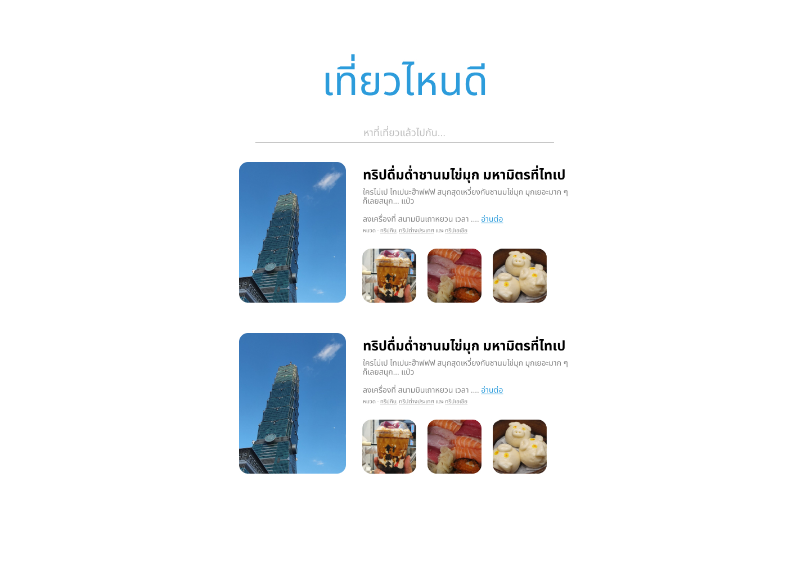

Jittipon Kumurai
นาย จิตติพล คำอุไร ครับ 
Frontend Developer
063-0491424

#### Requirement

สร้าง Web Application ที่ใช้ในการค้นหา trip จาก keyword ที่ user กรอกเข้ามา ตามตัวอย่าง Design ด้านล่าง โดยใช้ API จาก API Gateway ที่เราเขียนไว้ใน Task ที่ 1

ในการแสดงผลข้อมูลที่ได้มา จะต้องเป็นตามที่กำหนดไว้ดังต่อไปนี้

- [Done] เมื่อกดชื่อทริป จะต้อง link ไปยัง url ที่ได้จาก trip data
- [Done] เมื่อกดอ่านต่อ จะต้อง link ไปยัง url ที่ได้จาก trip data
- [Done] จะต้องมีการแสดงผลรูปที่ได้รับมา เพื่อดึงดูดให้ user กดเข้าไปที่ตัวทริป
- [Done] หมวดหมู่ที่แสดง สามารถกดและกลายเป็น search keyword โดยเป็นชื่อ tag นั้น
- [Done] User สามารถ copy link และส่งต่อไปให้เพื่อน สำหรับ keyword เดียวกัน

### How to run

ใช้ 4 เทอร์มิน่อลครับ 

terminal 1
    cd json-server
    npm start

terminal 2
    cd json-server
    npm run english

terminal 3
    cd api-gateway
    npm start
 - ใช้ node เขียนตัว api-gateway server ขึ้นมาครับมี getall กับ get by keyword

terminal 4
    cd web
    npm start

### UX improve

 - ปรับดีไซน์เล็กน้อยครับ พยายามทำให้เป็น card เเยกเป็น Item 
 - มีการใส่ Loader เข้ามาในกรณี Internet โหลดช้า พี่ลอง throtting network ได้ครับเป็น Fast/Slow 3G 
 - มีปุ่ม scroll to top มาครับถ้าเลื่อนลงมาโพสต์ด้านล่าง
 - ปิดกั้นการพิมพ์ spacebar เพื่อบล็อคไม่ให้ user กรอกอะไรแปลกๆลงมากันการเกิดข้อผิดพลาดครับ
 - มีฟังก์ชั่น replace   แทน /n เวลาแสดงข้อมูลจาก db ตามในดีไซน์
 - รูปภาพสามารถกดเพื่อขยายมาดูได้ ใช้ Image ของ antd ครับ **รูปที่ resolution ไม่เป็นสี่เหลียมจตุรัสจะเเปลกๆหน่อยครับเช่นรูปหอไอเฟ่ล
 - ไม่ได้รองรับ responsive design ครับเพราะคิดว่าจะใช้เวลามากเกินไปในการทำทั้งเวอร์ชั่น mobile และ tablet เเต่เคยทำ responsive design โดยใช้ mediaquery มาก่อนครับ
 - เพิ่มปุ่มเปลี่ยนภาษา thai or english มากดเเล้วจะทำการเปลี่ยนค่า language ที่เก็บใน localstorage เป็นภาษาที่เปลี่ยน เเล้วทำการรีเฟรชหน้าไปยังหน้าเเรก เเล้วทำการ fetch data ตามภาษาที่เปลี่ยน เห็นพี่เเยกมาเป็น db        สองอันผมเลยจะไม่เอามารวมกันเป็น db เดียวนะครับจะรันเเยกกันเป็นคนละ db จึงจำเป็นต้อง get data มาจากสอง database